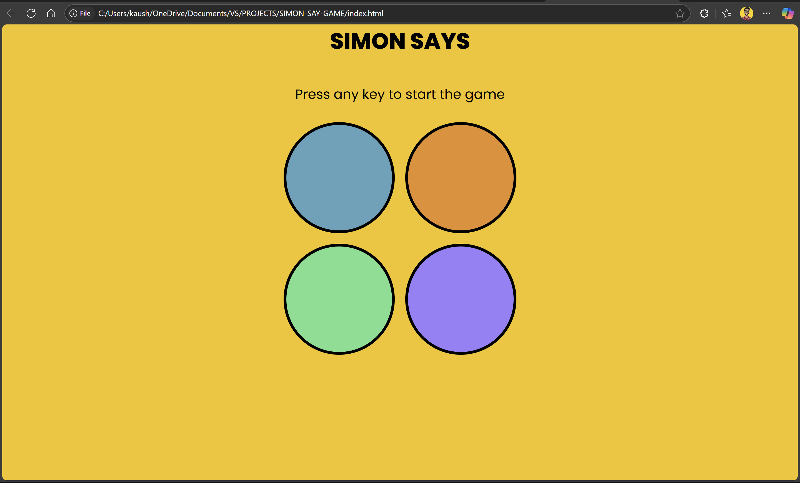

# 🧠 Simon Says Game

An interactive memory game built with **HTML**, **CSS**, and **JavaScript**. Inspired by the classic Simon game, this web app challenges players to remember and repeat a sequence of colors that increases in complexity with each round.

## 🎮 How to Play

1. Press any key to start the game.
2. Watch the color pattern that appears.
3. Repeat the pattern by clicking the circles in the same order.
4. Each round adds a new color to the sequence.
5. The game ends when a wrong input is detected.

---

## 💻 Technologies Used

- **HTML5**
- **CSS3**
- **JavaScript (Vanilla)**

---

## 📸 Screenshot



---

## 🧩 Features

- Dynamic and responsive UI
- Color pattern generated randomly
- Increasing difficulty level
- Simple DOM manipulation and event handling

---

## 🚀 Getting Started

1. Clone the repo:

```bash
git clone https://github.com/javac2001/SIMON-SAY-GAME.git


